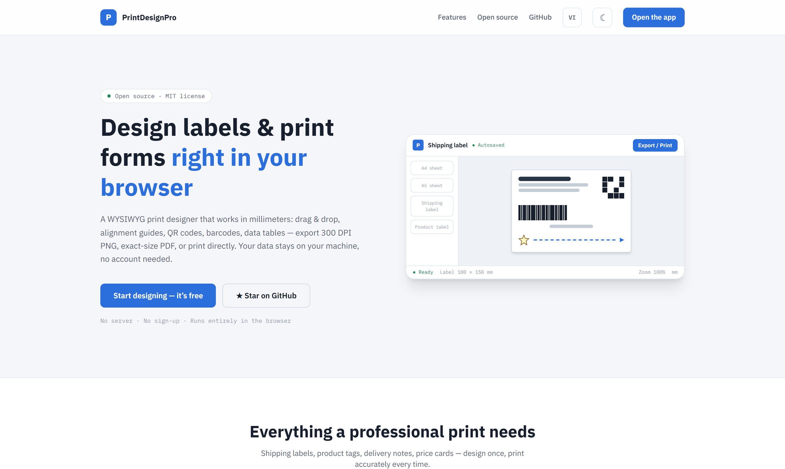
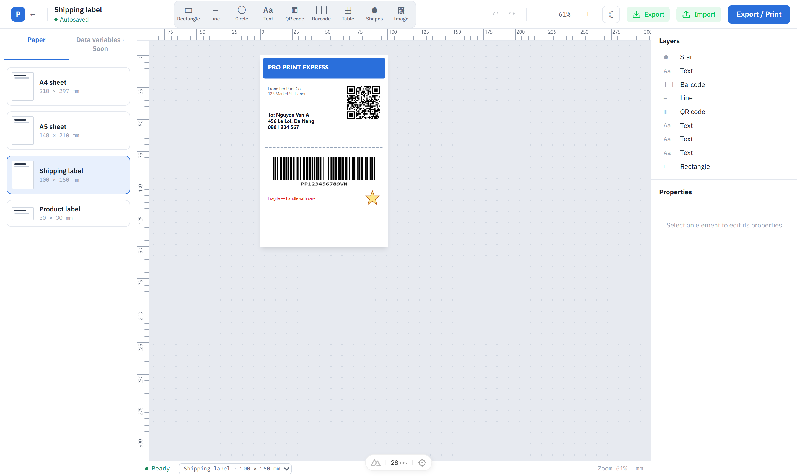
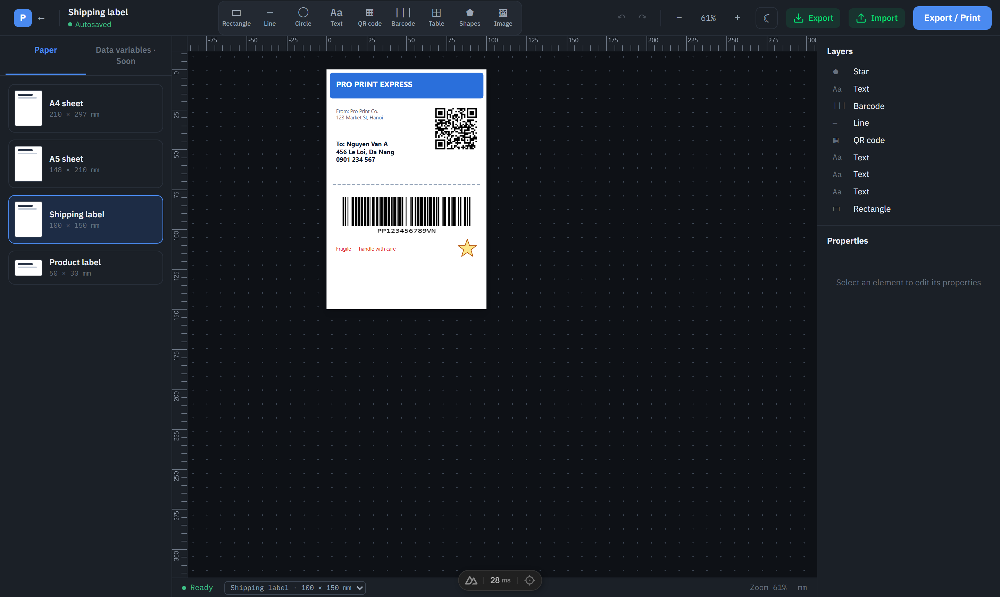
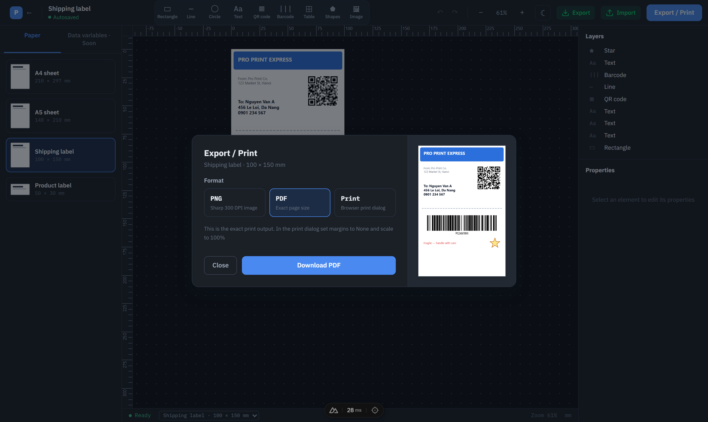

# PrintDesignPro

**Open-source WYSIWYG print designer for labels, receipts, and business forms — right in the browser.**

[](https://github.com/arenahub-gg/print-design-pro/actions)
[](./LICENSE)
[](https://vuejs.org)
[](https://nuxt.com)

**[▶ Try the live demo](https://arenahub-gg.github.io/print-design-pro/)** — no install, no account.

*Đọc bản tiếng Việt [bên dưới](#tiếng-việt) ↓*

Design shipping labels, product tags, and delivery notes in millimeters — what you see on screen is exactly what comes out of the printer. Local-first: your designs live in your browser (IndexedDB), no server, no account.



## Demo

| Light | Dark |
| --- | --- |
|  |  |



## Features

- **mm-precise editor** — rulers, grid, guides, smart snapping, rotate, lock, multi-select; every dimension in millimeters
- **True WYSIWYG output** — ONE render engine drives the screen, PNG export (300 DPI), PDF (exact page size), and browser print
- **Full element set** — text (12 selectable fonts), images, QR codes, barcodes (CODE128, EAN13, EAN8, CODE39, ITF14, UPC), data tables, and 14 shape kinds with solid/dashed/dotted strokes and line arrowheads
- **Productive editing** — copy/cut/paste, z-order controls, align & distribute on rotated bounding boxes, full keyboard map
- **Reliable undo/redo** — command pattern throughout; every edit is undoable, including page-size and table changes
- **Data variables + CSV batch printing** — put `{{name}}` tokens in text, QR codes, barcodes or table cells, then upload a CSV to print one page per row (multi-page PDF or a single print job)
- **Local-first** — templates persist to IndexedDB; export/import JSON to share; nothing leaves your machine
- **Embeddable** — the whole editor is a Vue 3 library (`@pro-print/editor`) with a simple `v-model` contract
- **Light & dark themes**, Vietnamese and English UI

## Quick start

Requires Node >= 20 and pnpm >= 11 (`corepack enable` recommended).

```bash
git clone https://github.com/arenahub-gg/print-design-pro.git
cd print-design-pro
pnpm install
pnpm dev        # app at http://localhost:3000
```

### Embed the editor in your Vue app

```bash
pnpm add @pro-print/editor
```

```vue
<script setup>
import { PrintDesigner, createEmptyTemplate } from '@pro-print/editor'
import '@pro-print/editor/style.css'
import { ref } from 'vue'

const template = ref(createEmptyTemplate('My label'))
// PrintDesigner emits debounced snapshots - persist them wherever you like.
</script>

<template>
  <PrintDesigner v-model="template" locale="en" class="h-screen" />
</template>
```

> Note: QR/barcode/PDF features load lazily via dynamic imports — use a bundler (the ESM build). The UMD build excludes them.

## Project structure

```
packages/editor   @pro-print/editor — embeddable Vue 3 editor library
  src/core        schema (zod), commands + undo history, geometry, layout
  src/render      ONE schema→Canvas2D engine: PNG / PDF / print / preview
  src/components  canvas renderers + PrintDesignPro editor shell
apps/web          Nuxt 4 app: landing, template manager, editor host
```

## Development

```bash
pnpm dev        # Nuxt app (apps/web) at :3000
pnpm dev:lib    # editor library watch build
pnpm --filter @pro-print/editor play   # bare Vue 3 playground at :5173
pnpm build      # build all packages
pnpm test       # unit + component tests (vitest, 115 tests)
pnpm test:e2e   # Playwright acceptance suite (chromium, 8 specs)
pnpm lint       # eslint
pnpm typecheck  # vue-tsc / nuxt typecheck (build the lib first)
```

To refresh the README screenshots: run the dev server, then
`node apps/web/scripts/capture-readme-screenshots.mjs`.

## Roadmap

Shipped: canvas editor, print pipeline (PNG/PDF/print), QR/barcode/image,
tables, PrintDesignPro UI with dark mode, color palette, stroke styles +
arrows, 14 shapes, landing page, EN/VI/ZH i18n, data variables + CSV batch
printing.

Next: multi-page table pagination, page-number element, batch barcode
pre-flight validation, npm publish, vector-text PDF.

## Contributing

Issues, ideas, and pull requests are welcome. The project is a clean-room
implementation — please don't submit code copied from other print designers.

## License

[MIT](./LICENSE)

---

## Tiếng Việt

**Trình thiết kế bản in WYSIWYG mã nguồn mở — tem vận chuyển, nhãn sản phẩm, phiếu giao hàng, ngay trên trình duyệt.**

Thiết kế theo đơn vị **milimet**: những gì bạn thấy trên màn hình chính xác là bản in ra. Local-first: thiết kế lưu trong trình duyệt của bạn (IndexedDB), không cần server, không cần tài khoản.

### Tính năng

- **Editor chuẩn mm** — thước, lưới, đường gióng, snap thông minh, xoay, khóa, chọn nhiều phần tử
- **In đúng như thiết kế** — MỘT render engine cho cả màn hình, xuất PNG 300 DPI, PDF đúng khổ giấy và in trình duyệt
- **Đủ phần tử** — văn bản, hình ảnh, mã QR, mã vạch (CODE128, EAN13…), bảng dữ liệu, 14 loại hình vẽ với nét liền/đứt/chấm và mũi tên
- **Biến dữ liệu + in hàng loạt CSV** — đặt `{{ten}}` trong văn bản/QR/mã vạch/ô bảng, tải CSV lên để in mỗi dòng một trang (PDF nhiều trang hoặc một lệnh in)
- **Hoàn tác tin cậy** — command pattern xuyên suốt, mọi thao tác đều undo được
- **Dữ liệu trong máy bạn** — lưu IndexedDB, xuất/nhập JSON để chia sẻ
- **Nhúng được** — toàn bộ editor là thư viện Vue 3 (`@pro-print/editor`) với `v-model` đơn giản
- **Giao diện sáng & tối**, tiếng Việt và tiếng Anh

### Bắt đầu

Yêu cầu Node >= 20 và pnpm >= 11.

```bash
git clone https://github.com/arenahub-gg/print-design-pro.git
cd print-design-pro
pnpm install
pnpm dev        # mở http://localhost:3000
```

Nhúng editor vào ứng dụng Vue: xem ví dụ ở [phần tiếng Anh](#embed-the-editor-in-your-vue-app) phía trên.

### Đóng góp

Issue, góp ý và pull request luôn được chào đón. Dự án viết mới hoàn toàn (clean-room) — vui lòng không gửi mã sao chép từ các trình thiết kế in khác.

### Giấy phép

[MIT](./LICENSE)
